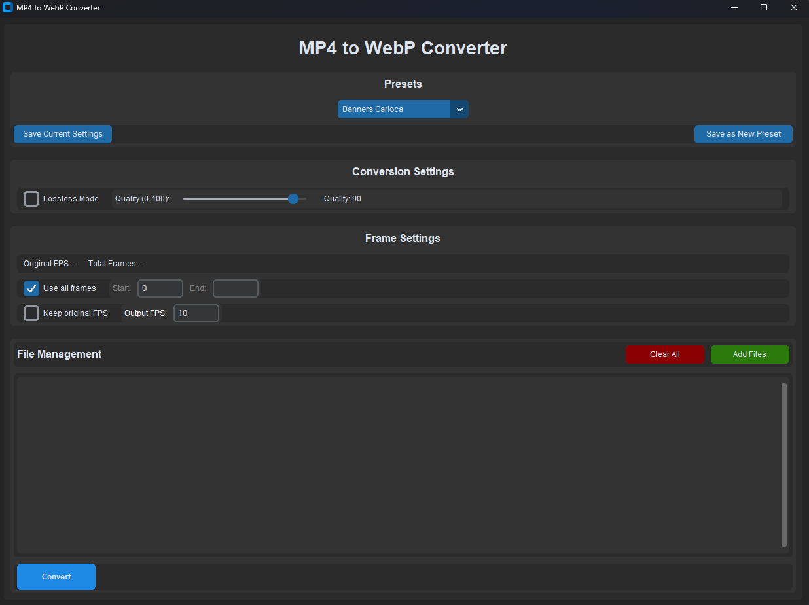

# MP4 to WebP Converter

A powerful desktop application built with Python and CustomTkinter that converts MP4 videos to WebP animations with advanced optimization options and file size control.



## Features

- **User-Friendly Interface**: Clean and modern dark-themed GUI
- **Batch Processing**: Convert multiple MP4 files simultaneously
- **Dual Configuration Modes**:
  - Settings-based configuration
  - Target file size optimization
- **Advanced Compression Options**:
  - Lossless/Lossy compression
  - Adjustable compression levels (0-6) and quality (0-100)
  - Smart file size optimization
- **Frame Control**:
  - FPS control (keep original or set custom)
  - Frame range selection
  - Automatic FPS adjustment for size optimization
- **Preset System**:
  - Built-in presets for common use cases
  - Save and load custom presets
  - Quick switching between configurations
- **Real-time Status**: Monitor conversion progress and file size reduction
- **Configuration Persistence**: Automatically saves your preferred settings

## Pre-built Presets

- **Banner Ads - High Quality**: Lossless compression optimized for maximum quality
- **Banner Ads - Balanced**: Balanced settings for good quality and file size
- **Banner Ads - Small Size**: Optimized for minimal file size while maintaining acceptable quality

## Requirements

- Python 3.7+
- FFmpeg (must be installed and accessible in system PATH)
- Required Python packages:
  ```
  customtkinter>=5.2.0
  Pillow>=10.0.0
  pathlib>=1.0.1
  ```

## Installation

1. Clone this repository:
   ```bash
   git clone https://github.com/rhcarlosweb/convert-mp4-to-webp.git
   ```

2. Install required Python packages:
   ```bash
   pip install -r requirements.txt
   ```

3. Install FFmpeg:
   - **Windows**: Download from [FFmpeg website](https://ffmpeg.org/download.html) and add to PATH
   - **macOS**: `brew install ffmpeg`
   - **Linux**: `sudo apt install ffmpeg` (Ubuntu/Debian) or equivalent

## Usage

1. Run the application:
   ```bash
   python mp4_to_webp_converter.py
   ```

2. Choose Configuration Mode:
   - **Settings Mode**: Manual control over all conversion parameters
   - **File Size Mode**: Automatic optimization to meet target file size

3. Add Files and Configure:
   - Click "Add Files" to select MP4 files
   - Choose a preset or adjust settings manually
   - Set target file size (in File Size Mode)

4. Adjust Advanced Settings (in Settings Mode):
   - Choose between lossless and lossy compression
   - Set compression level or quality
   - Configure FPS settings
   - Select specific frame ranges (optional)

5. Click "Convert" to start the process

## Advanced Settings

### Compression Modes

- **Lossless Mode**: 
  - Compression levels from 0-6
  - Level 6 provides best compression with no quality loss
  - Ideal for animations requiring perfect quality

- **Lossy Mode**:
  - Quality settings from 0-100
  - Higher values maintain better quality at larger file sizes
  - Recommended range: 65-85 for balanced results

### Frame Control

- **Use All Frames**: Convert the entire video
- **Frame Range**: Select specific start and end frames
- **FPS Options**: 
  - Keep original video FPS
  - Set custom FPS for output
  - Automatic FPS optimization in File Size Mode

### File Size Optimization

- Set target file size in MB
- Automatic adjustment of:
  - FPS (down to 10 FPS minimum)
  - Quality settings
  - Compression parameters

## Contributing

1. Fork the repository
2. Create your feature branch (`git checkout -b feature/AmazingFeature`)
3. Commit your changes (`git commit -m 'Add some AmazingFeature'`)
4. Push to the branch (`git push origin feature/AmazingFeature`)
5. Open a Pull Request

## License

This project is licensed under the MIT License - see the [LICENSE](LICENSE) file for details.

## Acknowledgments

- [CustomTkinter](https://github.com/TomSchimansky/CustomTkinter) for the modern UI components
- [FFmpeg](https://ffmpeg.org/) for the powerful video processing capabilities

## Support

If you encounter any issues or have questions, please [open an issue](https://github.com/rhcarlosweb/convert-mp4-to-webp/issues) on GitHub.